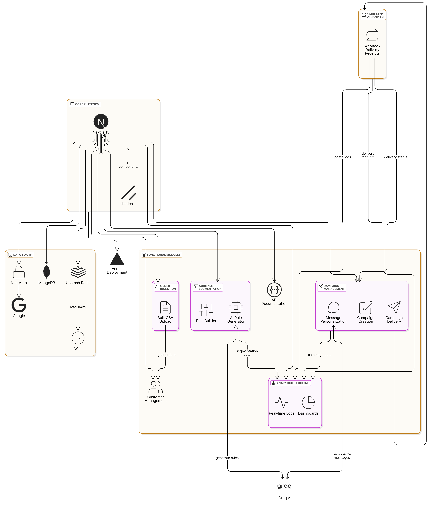

# Xeno-Sphere ( Xeno SDE Internship Assignment Thapar)

A full-stack, AI-powered Customer Relationship Management (CRM) platform built with Next.js 14 (App Router), MongoDB, NextAuth, shadcn/ui, and Groq.  
This project demonstrates customer segmentation, campaign management, order ingestion, and vendor integration with webhooks.

---
### 📽️Video Link: https://drive.google.com/file/d/1FA3AHychuFIXpjss_fuj02SVC5v01x4M/view?usp=sharing
### 🔗Deployed Link: https://xeno-assignment-mu.vercel.app/
---
## Features

- **Authentication:** Secure sign-up/sign-in with NextAuth (Google & credentials)
- **Customer Management:** Add, view, and segment customers
- **Audience Segmentation:** Create dynamic segments using rule builder or AI
- **Campaigns:** Create, preview, and deliver personalized campaigns
- **Order Management:** Bulk upload orders via CSV
- **Vendor Simulation:** Dummy vendor API with delivery receipts via webhook
- **AI Integration:** Generate audience rules and message templates with OpenAI
- **Dashboard:** View campaign logs, statuses, and analytics
- **Modern UI:** Built with shadcn/ui and Tailwind CSS and V0.dev
- **API Documentation:** Swagger UI for easy API exploration
- **Rate Limiting:** Upstash Redis for rate limiting
---

## Architecture Diagram

---
## API Endpoints

- `/api/auth` - Authentication routes (sign up, sign in, sign out)
- `/api/ai/generate-segment-rules` - AI integration for audience rules.
- `/api/ai/suggest-messages` - AI integration for message templates.
- `/api/customers` - Manage customers
- `/api/customers/bulk-upload` - Upload bulk customers via CSV
- `/api/orders` - Manage orders (supports bulk upload)
- `/api/orders/bulk-upload` - Upload bulk orders via CSV
- `/api/audiences` - Audience segment CRUD
- `/api/campaigns` - Campaign CRUD and delivery
- `/api/dummy-vendor/send` - Simulated vendor API
- `/api/webhooks/delivery-receipts` - Webhook for vendor delivery receipts
- `/api/swagger` - Swagger UI for API documentation 
---

## Bulk Upload

- **Customers:** Upload a CSV with headers: `name,email,phone,...`
- **Orders:** Upload a CSV with headers: `orderId,customerEmail,orderAmount,orderDate`

---

## Authentication

- Sign up/sign in with email/password or Google
- Protected routes and API endpoints

---

## AI Features

- Generate audience rules from natural language
- Generate campaign message templates

---
## Technologies Used
- **Frontend:** Next.js 14, shadcn/ui, Tailwind CSS, V0.dev
- **Backend:** Next.js API routes, MongoDB, NextAuth.js
- **Database:** MongoDB
- **Authentication:** NextAuth.js
- **AI Integration:** GROQ AI Inference
- **Deployment:** Vercel
- **API Documentation** Swagger UI
- **Rate Limiting** Upstash Redis  

## Contributing

1. Fork the repo
2. Create your feature branch (`git checkout -b feature/feature-name`)
3. Commit your changes
4. Push to the branch
5. Open a Pull Request

---

## Credits

- [Next.js](https://nextjs.org/)
- [MongoDB](https://www.mongodb.com/)
- [NextAuth.js](https://next-auth.js.org/)
- [shadcn/ui](https://ui.shadcn.com/)
- [Groq AI Inference](https://groq.dev/)
- [Vercel](https://vercel.com/)
- [Upstash Redis](https://upstash.com/)
- [Swagger UI](https://swagger.io/tools/swagger-ui/)
- [V0.dev](https://v0.dev/)
---

## Contact

Made by Hemant Kumar  
[GitHub](https://github.com/mr-hemnt/XenoAssignment)
[LinkedIn](https://www.linkedin.com/in/hemant-kumar-047262258/)
